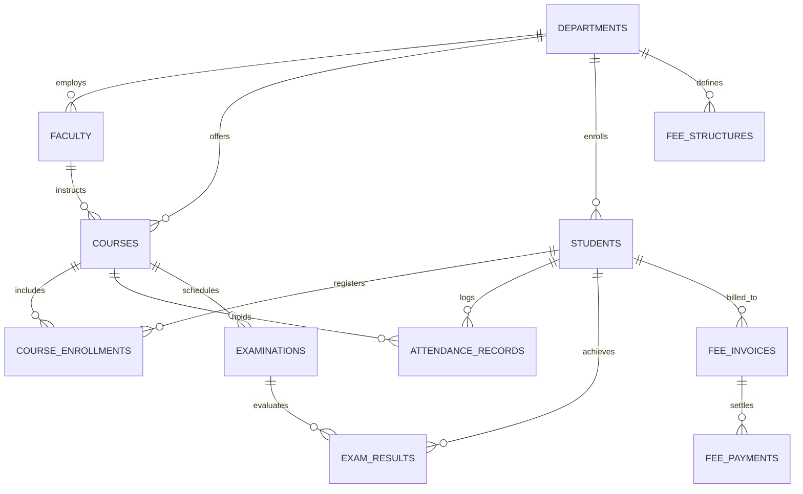

# 🏛️ Institute Management System (IMS Enterprise)

[](https://www.python.org/)
[](https://fastapi.tiangolo.com/)
[](https://www.sqlite.org/)
[](tests/)
[](pyproject.toml)
[](src/)

A modern, high-performance, and modular educational administration platform built with **FastAPI**, **SQLite** (WAL mode), and a responsive **Glassmorphism Web Dashboard**. Engineered for academic institutions, colleges, and university divisions to automate admissions, course scheduling, attendance registries, academic grading, and bursar financial audits.

---

## 📌 Executive Architecture & Highlights

* **Admissions & Scholar Registry:** Sequential institutional enrollment code generation (`IMS-YYYY-DEPT-XXXX`), full scholar profile management, department filtering, and real-time status transitions.
* **Faculty Directory & Curriculum:** Faculty instructor directory, multi-semester course catalog, credit tracking, and automated capacity-enforced student course enrollments.
* **Attendance & Examination Hub:** Daily session attendance registers (Present, Absent, Late, Excused), examination scheduling (Midterms, Finals, Quizzes), batch grade submission, and automated grading letter evaluation ($A^+, A, B, C, D, F$).
* **Bursar Invoicing & Financial Audit:** Standardized departmental fee schedules, student invoice issuance (`INV-YYYY-XXXX`), partial and full payment collection, unique receipt numbering (`REC-YYYY-XXXX`), overdue calculation, and financial ledger audit.
* **Sleek Enterprise UX:** Vanilla CSS glassmorphic theme (`#090d16` & `#0f172a`), interactive modals, responsive sidebar, toast notifications, and KPI overview cards.

---

## 🏗️ System Architecture & Entity Relationships



---

## 📁 Repository Directory Structure

```
Institute Management System/
├── data/
│   └── ims.db                      # SQLite database in WAL mode with foreign keys
├── scripts/
│   └── seed_demo_data.py           # Idempotent realistic demonstration dataset seeder
├── src/
│   ├── api/                        # Modular FastAPI REST API route handlers
│   │   ├── academics.py            # Attendance and examination endpoints
│   │   ├── courses.py              # Course catalog and enrollment endpoints
│   │   ├── faculty.py              # Faculty directory endpoints
│   │   ├── finance.py              # Invoicing, receipts, and audit endpoints
│   │   └── students.py             # Admissions and scholar endpoints
│   ├── core/
│   │   └── config.py               # Application configuration and path tokens
│   ├── database/
│   │   ├── connection.py           # SQLite connection pool and atomic transaction contexts
│   │   ├── init_db.py              # Schema deployment and seed verification
│   │   └── schema.sql              # Relational DDL schema with 11 tables & 13 indexes
│   ├── models/                     # Strongly-typed Pydantic schemas (v2)
│   │   ├── academics.py            # Attendance and exam request/response schemas
│   │   ├── course.py               # Course and enrollment schemas
│   │   ├── department.py           # Department schemas
│   │   ├── faculty.py              # Faculty schemas
│   │   ├── finance.py              # Fee structure, invoice, and payment schemas
│   │   └── student.py              # Admissions and scholar registry schemas
│   ├── services/                   # Business logic and database operations
│   │   ├── academics_service.py    # Attendance and exam evaluation logic
│   │   ├── course_service.py       # Course scheduling and capacity enforcement
│   │   ├── dashboard_service.py    # Executive KPI metric aggregations
│   │   ├── department_service.py   # Department operations
│   │   ├── faculty_service.py      # Faculty management
│   │   ├── finance_service.py      # Invoicing, receipts, and ledger audit
│   │   └── student_service.py      # Student registry and admission routines
│   └── app.py                      # FastAPI application, static mounting, and page routes
├── static/
│   ├── css/
│   │   └── style.css               # Design system: Glassmorphism, animations, toast rules
│   └── js/
│       └── app.js                  # Frontend utilities, modal handlers, and toast notifications
├── templates/                      # Jinja2 SSR Templates
│   ├── academics.html              # Attendance register and exam grading hub
│   ├── base.html                   # Global glassmorphic sidebar layout
│   ├── courses.html                # Course catalog and faculty roster portal
│   ├── dashboard.html              # Executive overview dashboard
│   ├── finance.html                # Invoicing, payment collection, and audit ledger
│   └── students.html               # Admissions and student registry directory
├── tests/                          # Automated Pytest validation suite
│   ├── conftest.py                 # Isolated test database runner
│   ├── test_academics_api.py       # Attendance and examination API test cases
│   ├── test_core_and_dashboard.py  # Health check and dashboard metrics test cases
│   ├── test_courses_and_faculty.py # Course catalog and faculty test cases
│   ├── test_finance_api.py         # Invoices, receipts, and ledger test cases
│   └── test_students_api.py        # Admissions and student test cases
├── pyproject.toml                  # Project metadata, Ruff rules, and Pytest configuration
├── requirements.txt                # Production dependencies
└── README.md                       # Architectural documentation
```

---

## 🔌 Complete RESTful API Reference

### 🎓 Admissions & Students
| Method | Endpoint | Description |
|---|---|---|
| `POST` | `/api/students` | Enroll a new student and issue sequential enrollment ID |
| `GET` | `/api/students` | List students with department, semester, and text filters |
| `GET` | `/api/students/{id}` | Retrieve individual student demographic profile |
| `PUT` | `/api/students/{id}` | Update scholar contact, address, or academic semester |
| `DELETE` | `/api/students/{id}` | Soft-delete / withdraw student registration |
| `GET` | `/api/students/stats/summary` | Academic enrollment metrics and semester breakdown |

### 📚 Faculty & Course Catalog
| Method | Endpoint | Description |
|---|---|---|
| `POST` | `/api/faculty` | Add faculty member with unique institutional faculty ID |
| `GET` | `/api/faculty` | List faculty roster filtered by department or status |
| `GET` | `/api/faculty/{id}` | Retrieve faculty instructor dossier |
| `POST` | `/api/courses` | Create an academic course with credits and seat capacity |
| `GET` | `/api/courses` | List course catalog with active enrollment counts |
| `POST` | `/api/courses/enroll` | Enroll student into course with capacity checking |
| `GET` | `/api/courses/{id}/students`| List all enrolled students for a specific course |

### 📝 Attendance & Examinations
| Method | Endpoint | Description |
|---|---|---|
| `POST` | `/api/academics/attendance/mark` | Batch mark daily session attendance (PRESENT/ABSENT/LATE) |
| `GET` | `/api/academics/attendance` | Retrieve session attendance roster for a course & date |
| `GET` | `/api/academics/attendance/student/{id}/summary` | Scholar attendance percentage and low-attendance alert |
| `POST` | `/api/academics/exams` | Schedule examination with weightage and passing marks |
| `GET` | `/api/academics/exams` | List scheduled examinations and grading statuses |
| `POST` | `/api/academics/exams/{id}/grades` | Batch submit student exam scores and calculate letter grades |
| `GET` | `/api/academics/exams/{id}/results` | Retrieve graded evaluation dossier and statistics |

### 💳 Fee Invoicing & Financial Audit
| Method | Endpoint | Description |
|---|---|---|
| `POST` | `/api/finance/fee-structures` | Configure standardized departmental semester fee schedule |
| `GET` | `/api/finance/fee-structures` | List departmental fee schedules |
| `POST` | `/api/finance/invoices` | Issue student fee invoice with unique number (`INV-2026-XXXX`) |
| `GET` | `/api/finance/invoices` | List fee invoices filtered by status, department, and search |
| `GET` | `/api/finance/invoices/{id}` | Get detailed invoice with historical payment receipts |
| `POST` | `/api/finance/payments` | Record fee payment, update balance, and issue receipt (`REC-XXXX`)|
| `GET` | `/api/finance/payments` | Query the real-time bursar payment audit ledger |
| `GET` | `/api/finance/summary` | Executive financial summary (billed, collected, collection rate) |

---

## 🚀 Quickstart & Installation

### 1. Prerequisites
* Python 3.10+ installed

### 2. Setup Virtual Environment
```bash
python -m venv .venv

# On Windows PowerShell:
.venv\Scripts\Activate.ps1

# On macOS/Linux:
source .venv/bin/activate
```

### 3. Install Dependencies
```bash
pip install -r requirements.txt
```

### 4. Seed Realistic Demonstration Data
```bash
python scripts/seed_demo_data.py
```

### 5. Launch Application Server
```bash
python -m uvicorn src.app:app --reload --port 8000
```
Open **[http://localhost:8000](http://localhost:8000)** in your browser:
* **Overview Dashboard:** `http://localhost:8000/`
* **Student Registry:** `http://localhost:8000/students`
* **Courses & Faculty:** `http://localhost:8000/courses`
* **Attendance & Exams:** `http://localhost:8000/academics`
* **Fee Invoicing & Audit:** `http://localhost:8000/finance`
* **Interactive OpenAPI Docs:** `http://localhost:8000/docs`

---

## 🧪 Testing & Verification

The test suite runs with isolated SQLite databases in temporary environments via pytest fixtures:

```bash
# Run all 45 automated unit and integration tests
pytest tests/ -v

# Run Ruff linter to confirm clean code hygiene
ruff check src/ tests/ scripts/
```

---

## 📄 License
This project is licensed under the [MIT License](LICENSE).
